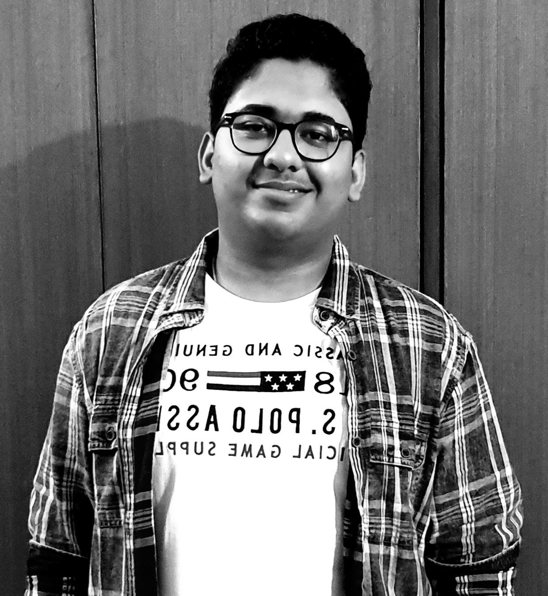

<html>
<meta name="viewport" content="width=device-width, initial-scale=1.0">
<head>
<title> "About Me"</title>

</head>
<body>

<h1 id = "myHeader" >Akash Agrawal</h1>

<h1 class = "subHeading"> Let me introduce myself: </h1>

 
<big><big><b>Hi , I am <b><i> Akash Agrawal</i></b> , I am a student at <a href = "http://www.iitb.ac.in" title ="Click on it to visit the website."> IIT Bombay </a> pursuing bachelors degree in Aerospace Engineering.
Being a stundent in one of the top most institute of India was my biggest dream.More than a dream, it was my passion
to get into IIT.I always loved learning something new. The equations in maths, the formulas in physics and the reactions in chemistry 
always fascinated me.Talking about my experience at IIT till date, I would say its amazing.  
I want to beacome a successful person and live my life happily and to the fullest.
</b>
</big></big>

<h1 class = "subHeading" > Things I like to do: </h1>
<ul class = " font" style = "font-size: 130%"; >
<li> <b>Cycling </b></li>
<li><b> Playing cricket, badminton, electronic games</b> </li>
<li> <b>Traveling </b></li>
<li> <b>Swimming</b> </li>
</ul>

 
 
 
 

</body>

</html>
